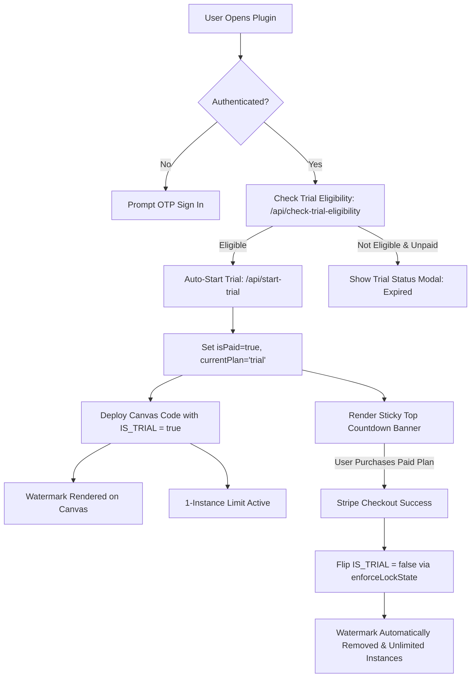

# Company Pricing Policies & Trial Lifecycle Reference Guide

This document details the pricing structures, Stripe monetization flows, 7-day free trial mechanics, 1-instance limit enforcement, and the automatic watermark removal protocol utilized across the company's Framer plugins.

---

## 1. Pricing Catalog & Stripe Configuration

All company Framer plugins utilize a standard 3-tier pricing model:

| Tier | Price | Model | Stripe Mode | Target Audience |
| :--- | :--- | :--- | :--- | :--- |
| **Monthly** | **$4.99 / mo** | Recurring subscription | Subscription | Short-term projects & evaluation |
| **Yearly** | **$49.99 / yr** | Recurring subscription | Subscription (Save ~16%) | Active creators & agencies |
| **Lifetime** | **$99.99** | One-time payment | PaymentIntent (Deal) | Power users & early adopters |

### 1.1. Stripe Credentials & Testing
- **Dynamic Configuration**: The plugin UI fetches the active Stripe publishable key dynamically via `GET /api/payment-config` rather than hardcoding keys in frontend code.
- **Test Card for Development**:
  - Number: `4242 4242 4242 4242`
  - Expiry: Any future date (e.g., `12/30`)
  - CVC: Any 3 digits (e.g., `123`)

---

## 2. The 7-Day Free Trial Lifecycle

Every new project is eligible for a full-featured 7-day free trial.



### 2.1. Anti-Abuse Validation Rules
To prevent perpetual re-trials across sessions, the backend enforces trial eligibility checks across **three distinct identifiers**:
1. Verified Account Email (`email`)
2. Framer Project ID (`site_id`)
3. Framer User ID (`framer_user_id`)

If any of these three has ever been associated with a trial in the database table (`plugin_trials`), eligibility is rejected:

```sql
SELECT id FROM plugin_trials 
WHERE email = ? OR site_id = ? OR (framer_user_id IS NOT NULL AND framer_user_id = ?)
LIMIT 1;
```

### 2.2. Development Acceleration: `TRIAL_DURATION_MINUTES`
For local development and rapid QA testing, the backend `.env` supports:
```env
# Fast 7-minute trial for local testing:
TRIAL_DURATION_MINUTES=7

# Production 7-day trial:
TRIAL_DURATION_DAYS=7
```

---

## 3. The Sticky Trial Countdown Banner

When an active trial is detected (`currentPlan === "trial" && isPaid`):
- Render a sticky top banner above the navigation bar in `App.tsx`.
- Real-time countdown calculation:
  - If remaining time is **under 24 hours**: Live ticker in `HH:MM:SS` format updated every second.
  - If remaining time is **over 24 hours**: Shows `X days left`.
- Inline Upgrade button with `<Crown size={12} />` jumping to the Subscription tab.

### Banner Component Implementation
```tsx
{paymentFlow.isPaid && paymentFlow.currentPlan === "trial" && (
  <div className="framefic-trial-sticky-banner">
    <div className="framefic-trial-ticker">
      <span className="framefic-trial-pill">Trial</span>
      <span className="framefic-trial-time">
        {trialSecondsRemaining < 86400
          ? formatCountdown(trialSecondsRemaining)
          : `${Math.ceil(trialSecondsRemaining / 86400)} days left`}
      </span>
    </div>
    <button
      className="framefic-trial-upgrade-btn"
      type="button"
      onClick={() => setActiveTab("subscription")}
    >
      <Crown size={12} /> Upgrade
    </button>
  </div>
)}
```

---

## 4. Rule 1: The 1-Instance Limit during Trial

During the trial period, users can add **each component only 1 time** into their Framer project.

### 4.1. Client UI Pre-Check Before Insertion
Before inserting a component, scan the Framer canvas:

```typescript
const isTrial = paymentFlow.isPaid && paymentFlow.currentPlan === "trial";

if (isTrial) {
  const instances = await framer.getNodesWithType("ComponentInstanceNode");
  const existingForThisComponent = instances.filter((i) =>
    i.name.includes(componentId) || (i as any).componentName?.includes(componentId)
  );

  if (existingForThisComponent.length >= 1) {
    framer.notify(
      "Trial plan allows 1 instance per component. Upgrade to PRO for unlimited components."
    );
    return;
  }
}
```

### 4.2. Primary CTA Gating
When the component is already on canvas and user is trialing, replace the primary CTA:
```tsx
{isTrial && hasInstanceOnCanvas ? (
  <button className="primary-cta" type="button" onClick={() => setActiveTab("subscription")}>
    <Crown size={16} /> Upgrade to Add More
  </button>
) : (
  <button className="primary-cta" type="button" onClick={handleInsert}>
    <Plus size={16} /> Add to Canvas
  </button>
)}
```

### 4.3. Canvas Duplicate Protection
If a user duplicates or copy-pastes the component on canvas, an internal runtime registry (`window.__myplugin_instances__`) detects duplicate instances:

```tsx
if (IS_TRIAL && isDuplicate) {
  return (
    <div className="framefic-duplicate-limit-container">
      <div className="framefic-duplicate-limit-card">
        <span className="framefic-limit-badge">Trial Limit: 1 Instance</span>
        <p className="framefic-limit-desc">
          Free trial allows 1 instance per component. Upgrade to PRO to add unlimited components.
        </p>
      </div>
    </div>
  );
}
```

---

## 5. Rule 2: The Mandatory Framefic Watermark Badge

When `IS_TRIAL === true`, all canvas components rendered on the canvas or published website **MUST** include the Framefic watermark badge.

```tsx
{IS_TRIAL && (
  <div className="framefic-trial-watermark">
    <a
      href="https://framefic.com"
      target="_blank"
      rel="noopener noreferrer"
      className="framefic-watermark-link"
    >
      <span className="framefic-watermark-text">Made with</span>
      <span className="framefic-watermark-brand">Framefic</span>
    </a>
  </div>
)}
```

### CSS Styling (External Styles Only):
```css
.framefic-trial-watermark {
  position: absolute;
  bottom: 12px;
  right: 12px;
  z-index: 9999;
  pointer-events: auto;
}

.framefic-watermark-link {
  display: inline-flex;
  align-items: center;
  gap: 4px;
  padding: 4px 10px;
  border-radius: 999px;
  background: rgba(15, 23, 42, 0.75);
  backdrop-filter: blur(8px);
  border: 1px solid rgba(255, 255, 255, 0.15);
  color: #ffffff;
  font-family: system-ui, -apple-system, sans-serif;
  font-size: 11px;
  text-decoration: none;
  transition: opacity 0.2s ease, transform 0.2s ease;
}

.framefic-watermark-link:hover {
  opacity: 0.9;
  transform: translateY(-1px);
}

.framefic-watermark-text {
  opacity: 0.65;
}

.framefic-watermark-brand {
  font-weight: 600;
  color: #708aff;
}
```

---

## 6. Rule 3: Automatic Watermark Removal Post-Purchase

Immediately when a user completes payment (Monthly, Yearly, or Lifetime):
1. `isSubscriptionFullyActive` becomes `true` and `isTrial` becomes `false`.
2. The `enforceLockState` effect in `App.tsx` dynamically rewrites all deployed CodeFiles:
   - `const IS_LOCKED = false;`
   - `const IS_TRIAL = false;`
   - `// @plugin-trial-state: paid`
3. **The Framefic Watermark is AUTOMATICALLY REMOVED** from all rendered canvas components.
4. The 1-instance limit is lifted, allowing unlimited insertions across all pages.
