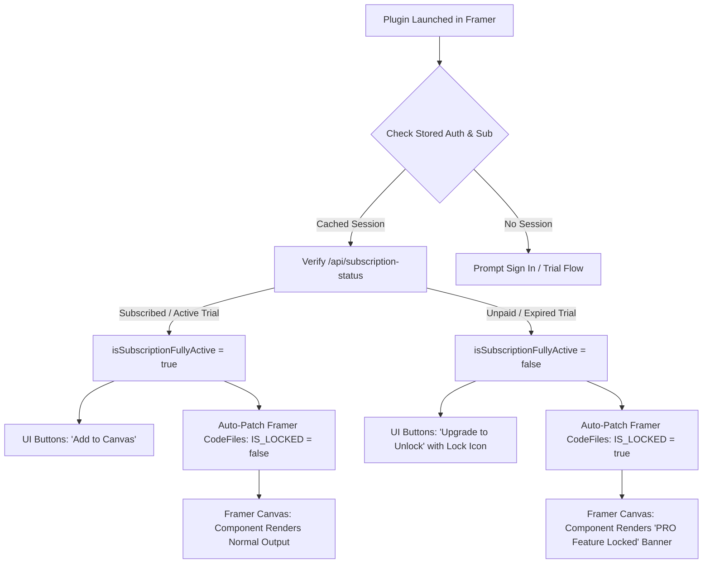

# Pro-Lock Engine Blueprint & Implementation Guide

This reference document details the complete technical architecture and drop-in code implementations for the **Dual-Layer Pro-Lock Licensing Engine** standardized for all company Framer plugins.

---

## 1. Architectural Flowchart



---

## 2. Layer 1: Frontend Client Hooks & Gating

### 2.1. The Auth Hook (`src/features/auth/hooks/useAuth.ts`)
Manages passwordless OTP authentication, session persistence, and project site linking.

```typescript
import { useCallback, useEffect, useState } from "react"
import {
  isLoggedIn as checkIsLoggedIn,
  getStoredUser,
  fetchCurrentUser,
  sendAuthOtp,
  verifyAuthOtp,
  updateSiteInfo,
  clearAuthData,
  setAuthData,
  setKnownSiteId,
  clearKnownSiteId,
  AuthUser,
} from "../services/authService"
import { getSiteInfo } from "../../../lib/framer/project"

export function useAuth() {
  const [user, setUser] = useState<AuthUser | null>(null)
  const [isLoggedIn, setIsLoggedIn] = useState<boolean>(false)
  const [isCheckingAuth, setIsCheckingAuth] = useState<boolean>(true)
  const [showAuthModal, setShowAuthModal] = useState<boolean>(false)
  const [authModalMode, setAuthModalMode] = useState<"register" | "login">("register")

  useEffect(() => {
    let isMounted = true

    const initialize = async () => {
      try {
        if (checkIsLoggedIn()) {
          const cachedUser = getStoredUser()
          if (cachedUser && isMounted) {
            setUser(cachedUser)
            setIsLoggedIn(true)
          }
        }

        try {
          const info = await getSiteInfo()
          if (info.siteId) setKnownSiteId(info.siteId)
        } catch {
          // Dev mode fallback
        }

        if (checkIsLoggedIn()) {
          const freshUser = await fetchCurrentUser()
          if (isMounted) {
            if (freshUser) {
              setUser(freshUser)
              setIsLoggedIn(true)
            } else if (!checkIsLoggedIn()) {
              setUser(null)
              setIsLoggedIn(false)
            }
          }
        }
      } catch {
        // Keep cached state on transient network failures
      } finally {
        if (isMounted) setIsCheckingAuth(false)
      }
    }

    void initialize()
    return () => { isMounted = false }
  }, [])

  const register = useCallback(async (data: { username: string; email: string }) => {
    const siteInfo = await getSiteInfo().catch(() => null)
    return await sendAuthOtp({
      username: data.username,
      email: data.email,
      siteId: siteInfo?.siteId || null,
      framerUserId: siteInfo?.userId || null,
      framerSiteName: siteInfo?.siteName || null,
      framerSiteUrl: siteInfo?.siteUrl || null,
    })
  }, [])

  const verifySignup = useCallback(async ({ email, code }: { email: string; code: string }) => {
    const result = await verifyAuthOtp({ email, code })
    setUser(result.user)
    setIsLoggedIn(true)
    setShowAuthModal(false)

    getSiteInfo()
      .then((info) => {
        if (info.siteId) setKnownSiteId(info.siteId)
        void updateSiteInfo({
          email: result.user.email,
          siteName: info.siteName,
          siteUrl: info.siteUrl,
          userId: result.user.id,
        })
      })
      .catch(() => {})
    return result
  }, [])

  const login = useCallback(async ({ email, code = null }: { email: string; code?: string | null }) => {
    if (code) return await verifySignup({ email, code })
    const siteInfo = await getSiteInfo().catch(() => null)
    return await sendAuthOtp({
      email,
      mode: "login",
      siteId: siteInfo?.siteId || null,
      framerUserId: siteInfo?.userId || null,
      framerSiteName: siteInfo?.siteName || null,
      framerSiteUrl: siteInfo?.siteUrl || null,
    })
  }, [verifySignup])

  const logout = useCallback(() => {
    clearAuthData()
    clearKnownSiteId()
    setUser(null)
    setIsLoggedIn(false)
    localStorage.removeItem("plugin_subscription_override")
  }, [])

  return {
    user,
    isLoggedIn,
    isCheckingAuth,
    showAuthModal,
    authModalMode,
    register,
    verifySignup,
    login,
    logout,
    openAuthModal: (mode: "login" | "register" = "register") => {
      setAuthModalMode(mode)
      setShowAuthModal(true)
    },
    closeAuthModal: () => setShowAuthModal(false),
  }
}
```

---

### 2.2. The Payment & Subscription Hook (`src/features/payment/hooks/usePaymentFlow.ts`)
Manages subscription status refreshes, 7-day trials, live countdown ticking, and Stripe checkouts.

```typescript
import { useCallback, useEffect, useState } from "react"
import { framer } from "framer-plugin"
import { getSiteInfo } from "../../../lib/framer/project"
import {
  createPaymentIntent,
  checkSubscriptionStatus,
  getPlanPricing,
  trackPaymentCompletion,
  checkLifetimeAvailability,
  startTrial,
  fetchPaymentConfig,
} from "../services/paymentService"

export function usePaymentFlow({ notify, userEmail, userName }: {
  notify: (p: { type: "Success" | "Error"; message: string }) => void
  userEmail?: string | null
  userName?: string | null
}) {
  const [isPaid, setIsPaid] = useState<boolean>(false)
  const [isCheckingPayment, setIsCheckingPayment] = useState<boolean>(true)
  const [currentPlan, setCurrentPlan] = useState<string | null>(null)
  const [planDetails, setPlanDetails] = useState<any>(null)
  const [showPaymentModal, setShowPaymentModal] = useState<boolean>(false)
  const [showPaymentSuccessModal, setShowPaymentSuccessModal] = useState<boolean>(false)
  const [clientSecret, setClientSecret] = useState<string | null>(null)
  const [publishableKey, setPublishableKey] = useState<string | null>(null)
  const [payingPlan, setPayingPlan] = useState<string | null>(null)

  useEffect(() => {
    fetchPaymentConfig().then((cfg) => {
      if (cfg?.publishableKey) setPublishableKey(cfg.publishableKey)
    }).catch(() => {})
  }, [])

  const refreshSubscriptionStatus = useCallback(async (overrideEmail?: string | null): Promise<boolean> => {
    try {
      const siteInfo = await getSiteInfo()
      const email = overrideEmail || userEmail || siteInfo.userEmail

      // Safe components count check
      let componentsCount = 0
      const isManaged = framer.mode === "configureManagedCollection" || framer.mode === "syncManagedCollection"
      if (!isManaged) {
        try {
          const files = await framer.getCodeFiles()
          componentsCount = files.filter((f) => f.name.startsWith("MyPlugin")).length
        } catch {}
      }

      // Check local override for instant post-purchase response
      const localOverride = localStorage.getItem("plugin_subscription_override")
      if (localOverride) {
        try {
          const parsed = JSON.parse(localOverride)
          if (!parsed.expiresAt || new Date(parsed.expiresAt) > new Date()) {
            setIsPaid(true)
            setCurrentPlan(parsed.plan)
            setPlanDetails(parsed)
          } else {
            localStorage.removeItem("plugin_subscription_override")
          }
        } catch {}
      }

      // Query authoritative status from server
      const status = await checkSubscriptionStatus(
        siteInfo.siteId,
        siteInfo.userId,
        email,
        componentsCount,
        siteInfo.siteName,
        siteInfo.siteUrl
      )

      const isExpired = status.expiresAt && status.plan !== "lifetime"
        ? new Date(status.expiresAt) <= new Date()
        : false

      const hasActive = status.isPaid && !isExpired &&
        ["monthly", "yearly", "lifetime", "trial"].includes(status.plan) &&
        ["active", "trialing", "paid", "Scheduled to cancel"].includes(status.status)

      if (hasActive) {
        setIsPaid(true)
        setCurrentPlan(status.plan)
        setPlanDetails({ ...status, fetchTimestamp: Date.now() })
        localStorage.removeItem("plugin_subscription_override")
      } else {
        setIsPaid(false)
        setCurrentPlan(null)
        setPlanDetails(status.isTrial ? { ...status, status: "expired" } : null)
      }

      return hasActive
    } catch {
      setIsPaid(false)
      return false
    }
  }, [userEmail])

  useEffect(() => {
    refreshSubscriptionStatus().finally(() => setIsCheckingPayment(false))
  }, [refreshSubscriptionStatus])

  // Real-time trial countdown ticker
  useEffect(() => {
    if (!planDetails?.isTrial || !isPaid || !planDetails?.trialEndsAt) return

    const initialSec = planDetails.trialSecondsRemaining ?? 0
    const fetchTime = planDetails.fetchTimestamp ?? Date.now()

    const getRemaining = () => {
      const elapsed = Math.floor((Date.now() - fetchTime) / 1000)
      return Math.max(0, initialSec - elapsed)
    }

    const timer = setInterval(() => {
      const left = getRemaining()
      if (left <= 0) {
        clearInterval(timer)
        setIsPaid(false)
        setCurrentPlan(null)
        setPlanDetails((p: any) => p ? { ...p, status: "expired", trialSecondsRemaining: 0 } : null)
      } else {
        setPlanDetails((p: any) => p ? { ...p, trialSecondsRemaining: left } : null)
      }
    }, 1000)

    return () => clearInterval(timer)
  }, [planDetails?.isTrial, planDetails?.trialEndsAt, isPaid, planDetails?.fetchTimestamp])

  const handleStartTrial = useCallback(async () => {
    const siteInfo = await getSiteInfo()
    const res = await startTrial(siteInfo.siteId, siteInfo.userId, 0, siteInfo.siteName, siteInfo.siteUrl)
    await refreshSubscriptionStatus()
    return res
  }, [refreshSubscriptionStatus])

  return {
    isPaid,
    isCheckingPayment,
    currentPlan,
    planDetails,
    showPaymentModal,
    showPaymentSuccessModal,
    clientSecret,
    publishableKey,
    payingPlan,
    refreshSubscriptionStatus,
    handleStartTrial,
    closePaymentModal: () => setShowPaymentModal(false),
  }
}
```

---

## 3. Layer 2: Automatic CodeFile Regex Patching in `App.tsx`

This effect monitors `isSubscriptionFullyActive` and syncs the lock state directly into the user's Framer project code files.

```typescript
// Auto-Lock Component File Enforcement
useEffect(() => {
  if (paymentFlow.isCheckingPayment) return

  let isMounted = true
  const enforceLockState = async () => {
    try {
      const isAllowed = typeof framer.isAllowedTo === "function" 
        ? framer.isAllowedTo("CodeFile.setFileContent") 
        : true
      if (!isAllowed) return

      const files = await framer.getCodeFiles()
      const pluginFiles = files.filter((f) => f.name.startsWith("MyPlugin"))

      for (const file of pluginFiles) {
        if (!isMounted) break
        const code = file.content

        // Rewrite IS_LOCKED constant
        let newCode = code.replace(
          /const IS_LOCKED = (true|false);/,
          `const IS_LOCKED = ${!isSubscriptionFullyActive};`
        )
        // Rewrite lock state comment marker
        newCode = newCode.replace(
          /\/\/ @myplugin-lock-state: (locked|unlocked)/,
          `// @myplugin-lock-state: ${isSubscriptionFullyActive ? 'unlocked' : 'locked'}`
        )

        const match = code.match(/const IS_LOCKED = (true|false);/)
        const currentlyLocked = match ? match[1] === "true" : false

        if (!match || currentlyLocked !== !isSubscriptionFullyActive) {
          await file.setFileContent(newCode)
        }
      }
    } catch (err) {
      console.warn("[Pro-Lock] Auto-lock enforcement deferred:", err)
    }
  }

  void enforceLockState()
  return () => { isMounted = false }
}, [isSubscriptionFullyActive, paymentFlow.isCheckingPayment])
```

---

## 4. Layer 3: Runtime In-Canvas Lock Watermark

Within the code generator template (e.g. `ComponentTemplate.ts`), render the frosted lock banner when `IS_LOCKED === true`:

```typescript
export function getComponentCode(configJson: string, isLocked: boolean = false): string {
  return `import React from "react";
import { addPropertyControls, ControlType } from "framer";

// @myplugin-lock-state: ${isLocked ? "locked" : "unlocked"}
const IS_LOCKED = ${isLocked};

const CONFIG = ${configJson};

const componentCss = \`
.myplugin-locked-container {
  position: relative;
  width: 100%;
  min-height: 80px;
  height: 100%;
  background-color: rgba(78, 79, 83, 0.45);
  display: flex;
  align-items: center;
  justify-content: center;
  overflow: hidden;
  border-radius: 8px;
  box-sizing: border-box;
}

.myplugin-locked-overlay {
  position: absolute;
  inset: 0;
  display: flex;
  align-items: center;
  justify-content: center;
  background: rgba(32, 31, 31, 0.75);
  backdrop-filter: blur(8px);
  -webkit-backdrop-filter: blur(8px);
  color: #ffffff;
  z-index: 999;
  padding: 16px;
  gap: 16px;
  font-family: -apple-system, BlinkMacSystemFont, 'Segoe UI', Roboto, sans-serif;
  box-sizing: border-box;
}

.myplugin-lock-icon-badge {
  background: rgba(255, 255, 255, 0.12);
  border: 1px solid rgba(255, 255, 255, 0.2);
  border-radius: 50%;
  width: 36px;
  height: 36px;
  display: flex;
  justify-content: center;
  align-items: center;
  flex-shrink: 0;
}

.myplugin-lock-text-group {
  display: flex;
  flex-direction: column;
  gap: 2px;
}

.myplugin-lock-title {
  font-size: 13px;
  font-weight: 600;
  letter-spacing: 0.2px;
  color: #ffffff;
}

.myplugin-lock-desc {
  font-size: 11px;
  opacity: 0.85;
  max-width: 420px;
  line-height: 1.4;
  color: #f1f5f9;
}
\`;

export default function MyComponent(props) {
  if (IS_LOCKED) {
    return (
      <>
        <style>{componentCss}</style>
        <div className="myplugin-locked-container">
          <div className="myplugin-locked-overlay">
            <div className="myplugin-lock-icon-badge">
              <svg width="16" height="16" viewBox="0 0 24 24" fill="none" stroke="#708AFF" strokeWidth="2.5" strokeLinecap="round" strokeLinejoin="round">
                <rect x="3" y="11" width="18" height="11" rx="2" ry="2" />
                <path d="M7 11V7a5 5 0 0 1 10 0v4" />
              </svg>
            </div>
            <div className="myplugin-lock-text-group">
              <div className="myplugin-lock-title">PRO Feature Locked</div>
              <div className="myplugin-lock-desc">
                Upgrade in the plugin to activate this component.
              </div>
            </div>
          </div>
        </div>
      </>
    );
  }

  // Normal Component rendering with external CSS...
  return (
    <>
      <style>{componentCss}</style>
      <div className="myplugin-container">
        {/* Component UI */}
      </div>
    </>
  );
}

addPropertyControls(MyComponent, {
  // Framer Property Controls
});
`;
}
```

---

## 5. Layer 4: Optional Live-Site Subscription Verification

For plugins where live published sites must dynamically enforce subscription status even if code files are not re-exported, include this lightweight runtime check inside the generated component:

```javascript
var SUBSCRIPTION_CACHE_KEY = "myplugin_sub_" + SITE_ID;
var SUBSCRIPTION_CACHE_TTL = 30 * 1000; // 30 seconds

function checkSubscriptionRuntime(siteId, apiUrl) {
  if (!siteId || !apiUrl) return Promise.resolve(null);
  try {
    var raw = typeof sessionStorage !== "undefined" ? sessionStorage.getItem(SUBSCRIPTION_CACHE_KEY) : null;
    if (raw) {
      var cached = JSON.parse(raw);
      if (Date.now() - cached.ts < SUBSCRIPTION_CACHE_TTL) {
        return Promise.resolve(cached.data);
      }
    }
  } catch(e) {}

  return fetch(apiUrl + "/api/subscription-status?siteId=" + encodeURIComponent(siteId))
    .then(function(res) { return res.json(); })
    .then(function(data) {
      try {
        sessionStorage.setItem(SUBSCRIPTION_CACHE_KEY, JSON.stringify({ ts: Date.now(), data: data }));
      } catch(e) {}
      return data;
    })
    .catch(function() { return null; });
}
```

---

## 6. The Trial User Flow: 1-Instance Limit & Framefic Watermark Engine

### 6.1. The 1-Instance Limit Enforcement (Client UI Level)
During a 7-day trial (`isPaid && currentPlan === "trial"`), the user is restricted to adding **each component only 1 time**.

In the plugin configurator before calling `framer.addComponentInstance`:
```typescript
const handleInsertComponent = async (componentId: string) => {
  // Check existing canvas instances
  const instances = await framer.getNodesWithType("ComponentInstanceNode")
  const existingForThisComponent = instances.filter((inst) => 
    inst.name.includes(componentId) || inst.componentName?.includes(componentId)
  )

  const isTrial = paymentFlow.isPaid && paymentFlow.currentPlan === "trial"

  if (isTrial && existingForThisComponent.length >= 1) {
    framer.notify("Trial users can add each component only 1 time. Upgrade to PRO to add unlimited components.")
    return
  }

  // Proceed with unlocked insertion
  await framer.addComponentInstance({ ... })
}
```

In the Primary CTA rendering:
```tsx
const isAtTrialLimit = isTrial && existingInstancesCount >= 1

if (isAtTrialLimit) {
  return (
    <button className="primary-cta" type="button" onClick={onUpgrade}>
      <Lock size={16} /> Upgrade to Add More
    </button>
  )
}
```

### 6.2. Framefic Watermark & Canvas Duplicate Detection (Generated Code Level)
Inside `ComponentTemplate.ts`, the component includes:
1. `const IS_TRIAL = true|false;` (patched by `App.tsx` regex).
2. The **Framefic Watermark Badge** displayed at the corner of the component whenever `IS_TRIAL === true`.
3. An instance registry `__myplugin_instances__` that prevents trial users from copying/pasting duplicate components directly on the Framer canvas.
4. **Automatic Removal Post-Purchase**: Once the user buys a paid plan (`monthly`, `yearly`, `lifetime`), `IS_TRIAL` is rewritten to `false`, instantly removing the watermark badge and lifting the 1-instance restriction!

```typescript
export function getComponentCode(configJson: string, isLocked: boolean = false, isTrial: boolean = true): string {
  return `import React from "react";
import { addPropertyControls, ControlType } from "framer";

// @myplugin-lock-state: ${isLocked ? "locked" : "unlocked"}
const IS_LOCKED = ${isLocked};

// @myplugin-trial-state: ${isTrial ? "trial" : "paid"}
const IS_TRIAL = ${isTrial};

const CONFIG = ${configJson};

const __myplugin_instances__ = {};

const componentCss = \`
/* Watermark & Limit Styles from design-tokens.css */
.framefic-trial-watermark {
  position: absolute;
  bottom: 8px;
  right: 12px;
  z-index: 50;
  pointer-events: auto;
  user-select: none;
}
.framefic-watermark-link {
  display: inline-flex;
  align-items: center;
  gap: 4px;
  padding: 3px 8px;
  border-radius: 999px;
  background: rgba(15, 23, 42, 0.65);
  backdrop-filter: blur(6px);
  -webkit-backdrop-filter: blur(6px);
  border: 1px solid rgba(255, 255, 255, 0.15);
  text-decoration: none;
  font-family: Inter, sans-serif;
  font-size: 10px;
  line-height: 1;
}
.framefic-watermark-text { color: #94a3b8; font-weight: 400; }
.framefic-watermark-brand { color: #ffffff; font-weight: 600; }

.framefic-duplicate-limit-container {
  width: 100%;
  height: 100%;
  min-height: 100px;
  display: flex;
  align-items: center;
  justify-content: center;
  padding: 20px;
  box-sizing: border-box;
  background-color: #242323;
  border: 1px dashed #3b3a3a;
  border-radius: 8px;
}
.framefic-limit-badge {
  font-size: 11px;
  font-weight: 600;
  color: #ffc745;
  background: rgba(255, 199, 69, 0.12);
  border: 1px solid rgba(255, 199, 69, 0.25);
  padding: 4px 10px;
  border-radius: 999px;
  text-transform: uppercase;
}
.framefic-limit-desc {
  font-size: 12px;
  line-height: 1.5;
  color: #c7ccd6;
  text-align: center;
  margin-top: 8px;
}
\`;

export default function MyComponent(props) {
  const instanceId = React.useMemo(() => Math.random().toString(36).substring(2, 9), []);
  const [isDuplicate, setIsDuplicate] = React.useState(false);

  React.useEffect(() => {
    const cid = props.componentId || "default";
    if (!__myplugin_instances__[cid]) __myplugin_instances__[cid] = [];
    if (!__myplugin_instances__[cid].includes(instanceId)) {
      __myplugin_instances__[cid].push(instanceId);
    }
    // During trial, only 1 instance allowed
    if (IS_TRIAL && __myplugin_instances__[cid].indexOf(instanceId) > 0) {
      setIsDuplicate(true);
    } else {
      setIsDuplicate(false);
    }

    return () => {
      if (__myplugin_instances__[cid]) {
        const idx = __myplugin_instances__[cid].indexOf(instanceId);
        if (idx >= 0) __myplugin_instances__[cid].splice(idx, 1);
      }
    };
  }, [props.componentId, instanceId]);

  if (IS_LOCKED) {
    return <ProLockBanner />;
  }

  if (IS_TRIAL && isDuplicate) {
    return (
      <>
        <style>{componentCss}</style>
        <div className="framefic-duplicate-limit-container">
          <div className="framefic-duplicate-limit-card">
            <span className="framefic-limit-badge">Trial Limit: 1 Instance</span>
            <p className="framefic-limit-desc">
              Free trial allows 1 instance per component. Upgrade to PRO to add unlimited components.
            </p>
          </div>
        </div>
      </>
    );
  }

  return (
    <>
      <style>{componentCss}</style>
      <div className="myplugin-container" style={{ position: "relative" }}>
        {/* Component Content */}

        {/* Framefic Watermark: Visible ONLY during trial, automatically hidden after purchase */}
        {IS_TRIAL && (
          <div className="framefic-trial-watermark">
            <a
              href="https://framefic.com"
              target="_blank"
              rel="noopener noreferrer"
              className="framefic-watermark-link"
            >
              <span className="framefic-watermark-text">Made with</span>
              <span className="framefic-watermark-brand">Framefic</span>
            </a>
          </div>
        )}
      </div>
    </>
  );
}
`;
}
```

### 6.3. Auto-Patching `IS_TRIAL` in `App.tsx`
The `enforceLockState` effect in `App.tsx` updates both `IS_LOCKED` and `IS_TRIAL`:

```typescript
const isSubscriptionFullyActive = paymentFlow.isPaid &&
  (!paymentFlow.planDetails ||
    ["lifetime", "monthly", "yearly", "trial"].includes(paymentFlow.planDetails.plan))

const isTrial = paymentFlow.isPaid && paymentFlow.currentPlan === "trial"

// Inside enforceLockState:
let newCode = code.replace(
  /const IS_LOCKED = (true|false);/,
  `const IS_LOCKED = ${!isSubscriptionFullyActive};`
)
newCode = newCode.replace(
  /const IS_TRIAL = (true|false);/,
  `const IS_TRIAL = ${isTrial};`
)
newCode = newCode.replace(
  /\/\/ @myplugin-trial-state: (trial|paid|expired)/,
  `// @myplugin-trial-state: ${!isSubscriptionFullyActive ? 'expired' : isTrial ? 'trial' : 'paid'}`
)
```
