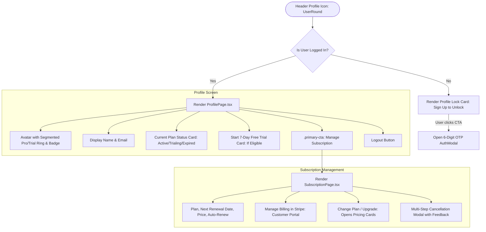

# Profile Page & Subscription Management UI Architecture

This reference document defines the complete **Profile Page & Subscription Management Workflow** used across all company Framer plugins. It provides the drop-in React TypeScript components, state management contracts, and modular external stylesheets following the company's **Zero Inline CSS Rule**, **`.primary-cta` Standard**, and **Light/Dark Mode Theme Synchronization**.

---

## 1. User Journey & Navigation Flow

The Profile and Subscription pages are accessed via the header profile icon (`<UserRound />`):



---

## 2. Profile Page Component (`src/profile/ProfilePage.tsx`)

```tsx
import { useEffect, useMemo, useState } from "react";
import { Lock, Crown, Clock, LogOut } from "lucide-react";
import { getSiteInfo } from "../lib/framer/project";
import "./ProfilePage.css";

export interface ProfilePageProps {
  onManageSubscription: () => void;
  authUser: { username?: string; email?: string; avatar_url?: string } | null;
  onLogout: () => void;
  onSignUp: () => void;
  onSignIn: () => void;
  hasSubscription: boolean;
  planDetails: {
    plan?: string;
    status?: string;
    isTrial?: boolean;
    trialSecondsRemaining?: number;
  } | null;
  onRefreshSubscription?: () => Promise<boolean>;
  onStartTrial?: () => Promise<any>;
}

export function ProfilePage({
  onManageSubscription,
  authUser,
  onLogout,
  onSignUp,
  onSignIn,
  hasSubscription,
  planDetails,
  onRefreshSubscription,
  onStartTrial,
}: ProfilePageProps) {
  const [userName, setUserName] = useState<string>("");
  const [userEmail, setUserEmail] = useState<string>("");
  const [isStartingTrial, setIsStartingTrial] = useState<boolean>(false);
  const [avatarError, setAvatarError] = useState<boolean>(false);

  const hasAlreadyTakenTrial = !!planDetails?.isTrial;
  const isProUser = hasSubscription && !planDetails?.isTrial;
  const isTrialUser = hasSubscription && !!planDetails?.isTrial;

  useEffect(() => {
    let isMounted = true;
    const loadUserInfo = async () => {
      try {
        const siteInfo = await getSiteInfo();
        if (!isMounted) return;
        setUserName(siteInfo.userName || "");
        setUserEmail(siteInfo.userEmail || "");
      } catch (err) {
        console.error("Error loading user info:", err);
      }
    };
    void loadUserInfo();
    return () => { isMounted = false; };
  }, []);

  useEffect(() => {
    void onRefreshSubscription?.();
  }, [onRefreshSubscription]);

  const displayName = authUser?.username || userName || "Designer";
  const displayEmail = authUser?.email || userEmail || "-";

  const avatarInitials = useMemo(() => {
    const parts = displayName.trim().split(/\s+/).filter(Boolean);
    if (parts.length === 0) return "U";
    if (parts.length === 1) return parts[0].slice(0, 2).toUpperCase();
    return `${parts[0][0]}${parts[1][0]}`.toUpperCase();
  }, [displayName]);

  // Auth gate when user is not logged in
  if (!authUser) {
    return (
      <div className="framefic-profile-page connections-panel--locked">
        <div className="pro-lock-card">
          <div className="pro-lock-icon-wrapper">
            <Lock className="pro-lock-icon" width={28} height={28} />
          </div>
          <h2>Unlock Profile</h2>
          <p>
            Sign in to check your subscription status, manage your account details, and review active sessions.
          </p>
          <button className="primary-cta pro-unlock-btn" type="button" onClick={onSignUp || onSignIn}>
            Sign In to Unlock
          </button>
        </div>
      </div>
    );
  }

  const getPlanName = (plan?: string): string => {
    switch (plan) {
      case "monthly": return "Pro Monthly";
      case "yearly": return "Pro Yearly";
      case "lifetime": return "Lifetime Deal";
      case "trial": return "Free Trial";
      default: return "Free";
    }
  };

  const getStatusLabel = (status?: string): string => {
    if (!status) return hasSubscription ? "Active" : "Inactive";
    return status.charAt(0).toUpperCase() + status.slice(1).replace(/_/g, " ");
  };

  const planName = getPlanName(planDetails?.plan);
  const planStatusLabel = getStatusLabel(planDetails?.status);
  const planStatusClass = hasSubscription
    ? "framefic-profile-plan-status framefic-profile-plan-status--active"
    : "framefic-profile-plan-status framefic-profile-plan-status--inactive";

  const handleStartTrialClick = async () => {
    if (isStartingTrial || !onStartTrial) return;
    setIsStartingTrial(true);
    try {
      await onStartTrial();
    } finally {
      setIsStartingTrial(false);
    }
  };

  return (
    <div className="framefic-profile-page">
      <div className="framefic-profile-header">
        <h3>Profile</h3>
      </div>

      <div className="framefic-profile-hero">
        <div className="framefic-profile-avatar-container">
          {(isProUser || isTrialUser) && (
            <svg
              className="framefic-avatar-segmented-ring"
              viewBox="0 0 100 100"
              shapeRendering="geometricPrecision"
            >
              <defs>
                <linearGradient id="pro-ring-grad" x1="0%" y1="0%" x2="100%" y2="100%">
                  <stop offset="0%" stopColor="#5271FF" />
                  <stop offset="50%" stopColor="#708AFF" />
                  <stop offset="100%" stopColor="#3B58FF" />
                </linearGradient>
                <linearGradient id="trial-ring-grad" x1="0%" y1="0%" x2="100%" y2="100%">
                  <stop offset="0%" stopColor="#d1a918" />
                  <stop offset="50%" stopColor="#a07801" />
                  <stop offset="100%" stopColor="#ebce2b" />
                </linearGradient>
              </defs>
              <circle
                cx="50"
                cy="50"
                r="43"
                fill="none"
                stroke={isProUser ? "url(#pro-ring-grad)" : "url(#trial-ring-grad)"}
                strokeWidth="3"
                strokeLinecap="round"
                strokeDasharray="60 8"
                transform="rotate(-60 50 50)"
              />
            </svg>
          )}

          <div className="framefic-profile-avatar-circle">
            {authUser?.avatar_url && !avatarError ? (
               setAvatarError(true)}
              />
            ) : (
              avatarInitials
            )}
          </div>

          {isProUser ? (
            <div className="framefic-avatar-badge framefic-avatar-badge--pro" title="Pro Member">
              <Crown fill="currentColor" width={13} height={13} />
              <span>PRO</span>
            </div>
          ) : isTrialUser ? (
            <div className="framefic-avatar-badge framefic-avatar-badge--trial" title="7-Day Free Trial Active">
              <Clock width={13} height={13} />
              <span>TRIAL</span>
            </div>
          ) : null}
        </div>

        <div className="framefic-profile-identity">
          <div className="framefic-profile-name">{displayName}</div>
          <div className="framefic-profile-email">{displayEmail}</div>
        </div>
      </div>

      <div className="framefic-profile-plan-card">
        <div className="framefic-profile-plan-top">
          <div className="framefic-profile-plan-info">
            <span className="framefic-profile-plan-label">Plan Type</span>
            <span className="framefic-profile-plan-name">{planName}</span>
          </div>
          <span className={planStatusClass}>{planStatusLabel}</span>
        </div>
        <div className="framefic-profile-plan-divider"></div>
        <button
          type="button"
          className="primary-cta"
          onClick={onManageSubscription}
        >
          Manage Subscription
        </button>
      </div>

      {!hasSubscription && !hasAlreadyTakenTrial && (
        <div className="framefic-profile-trial-card">
          <h4 className="framefic-trial-heading">Start Your 7-Day Free Trial</h4>
          <p className="framefic-trial-desc">
            Get full access to all Pro features and premium styles for 7 days. No credit card required.
          </p>
          <button
            type="button"
            className="primary-cta"
            disabled={isStartingTrial}
            onClick={handleStartTrialClick}
          >
            {isStartingTrial ? "Activating Trial..." : "Start 7-Day Free Trial"}
          </button>
        </div>
      )}

      <div className="framefic-profile-logout-row">
        <button type="button" className="framefic-profile-logout-btn" onClick={onLogout}>
          <LogOut size={14} /> Log Out
        </button>
      </div>
    </div>
  );
}
```

---

## 3. Subscription Management Page (`src/profile/SubscriptionPage.tsx`)

Provides complete subscription controls, renewal visibility, Stripe Customer Portal linking, and plan switching.

```tsx
import { useState } from "react";
import { ArrowLeft, ExternalLink, ShieldCheck } from "lucide-react";
import { getSiteInfo } from "../lib/framer/project";
import { createBillingPortalSession, cancelSubscription } from "../features/payment/services/paymentService";
import { PaymentPlans } from "../features/payment/components/PaymentPlans";
import "./SubscriptionPage.css";

export interface SubscriptionPageProps {
  onClose: () => void;
  hasSubscription: boolean;
  planDetails: {
    plan?: string;
    status?: string;
    isTrial?: boolean;
    expiresAt?: string;
  } | null;
  onPay: (e: any, planKey: string) => void;
  onRefreshSubscription: () => Promise<boolean>;
  notify: (p: { type: "Success" | "Error"; message: string }) => void;
}

export function SubscriptionPage({
  onClose,
  hasSubscription,
  planDetails,
  onPay,
  onRefreshSubscription,
  notify,
}: SubscriptionPageProps) {
  const [showPlans, setShowPlans] = useState<boolean>(!hasSubscription);
  const [isLoadingPortal, setIsLoadingPortal] = useState<boolean>(false);
  const [isCancelling, setIsCancelling] = useState<boolean>(false);

  const handleManageBilling = async () => {
    try {
      setIsLoadingPortal(true);
      const siteInfo = await getSiteInfo();
      const res = await createBillingPortalSession(siteInfo.siteId);
      if (res.url) {
        window.open(res.url, "_blank", "noopener,noreferrer");
      }
    } catch (err: any) {
      notify({ type: "Error", message: err.message || "Failed to open billing portal" });
    } finally {
      setIsLoadingPortal(false);
    }
  };

  const handleCancel = async () => {
    if (!window.confirm("Are you sure you want to cancel your Pro subscription?")) return;
    try {
      setIsCancelling(true);
      const siteInfo = await getSiteInfo();
      await cancelSubscription(siteInfo.siteId);
      notify({ type: "Success", message: "Subscription cancelled successfully." });
      await onRefreshSubscription();
    } catch (err: any) {
      notify({ type: "Error", message: err.message || "Failed to cancel subscription." });
    } finally {
      setIsCancelling(false);
    }
  };

  return (
    <div className="framefic-subscription-page">
      <div className="framefic-subscription-header">
        <button type="button" className="framefic-back-btn" onClick={onClose}>
          <ArrowLeft size={16} />
        </button>
        <h3>Manage Subscription</h3>
      </div>

      {!showPlans ? (
        <div className="framefic-subscription-content">
          <div className="framefic-sub-overview-card">
            <div className="framefic-sub-row">
              <span className="framefic-sub-label">Current Plan</span>
              <span className="framefic-sub-val framefic-sub-val--bold">
                {planDetails?.plan === "yearly"
                  ? "Pro Yearly"
                  : planDetails?.plan === "lifetime"
                  ? "Lifetime Deal"
                  : planDetails?.plan === "trial"
                  ? "Free Trial"
                  : "Pro Monthly"}
              </span>
            </div>
            <div className="framefic-sub-row">
              <span className="framefic-sub-label">Status</span>
              <span className="framefic-status-badge">{planDetails?.status || "Active"}</span>
            </div>
            {planDetails?.expiresAt && (
              <div className="framefic-sub-row">
                <span className="framefic-sub-label">Next Renewal</span>
                <span className="framefic-sub-val">{planDetails.expiresAt}</span>
              </div>
            )}
          </div>

          <div className="framefic-sub-actions">
            <button
              type="button"
              className="primary-cta"
              disabled={isLoadingPortal}
              onClick={handleManageBilling}
            >
              <ExternalLink size={14} /> {isLoadingPortal ? "Loading Portal..." : "Manage Billing in Stripe"}
            </button>

            <button
              type="button"
              className="framefic-secondary-btn"
              onClick={() => setShowPlans(true)}
            >
              Change Plan / Upgrade
            </button>

            <button
              type="button"
              className="framefic-danger-btn"
              disabled={isCancelling}
              onClick={handleCancel}
            >
              {isCancelling ? "Cancelling..." : "Cancel Subscription"}
            </button>
          </div>
        </div>
      ) : (
        <div className="framefic-plans-view">
          <PaymentPlans onSelectPlan={(plan) => onPay(null, plan)} currentPlan={planDetails?.plan} />
          {hasSubscription && (
            <button
              type="button"
              className="framefic-secondary-btn framefic-plans-back-btn"
              onClick={() => setShowPlans(false)}
            >
              Back to Overview
            </button>
          )}
        </div>
      )}
    </div>
  );
}
```

---

## 4. Key UI Style Specifications (`ProfilePage.css` & `SubscriptionPage.css`)

All styling uses the company's external tokens with **Strict Zero Inline CSS**:

1. **Avatar Segmented Ring**:
   - `stroke-dasharray: 60 8` with drop shadow filter.
   - Pro: `#5271FF` to `#3B58FF`.
   - Trial: `#d1a918` to `#ebce2b`.
2. **Pro & Trial Badges**:
   - Pill badge anchored at `bottom: 8px`, `right: -6px`.
   - Double-gradient border matching `.primary-cta`.
3. **Plan Type Card**:
   - Background: `var(--bg-card-inner)`
   - Border: `1px solid var(--framefic-surface-border)`
   - Internal divider: `1px solid var(--framefic-surface-border)`
4. **Primary CTA**:
   - "Manage Subscription" uses `.primary-cta` with signature double-gradient border.
