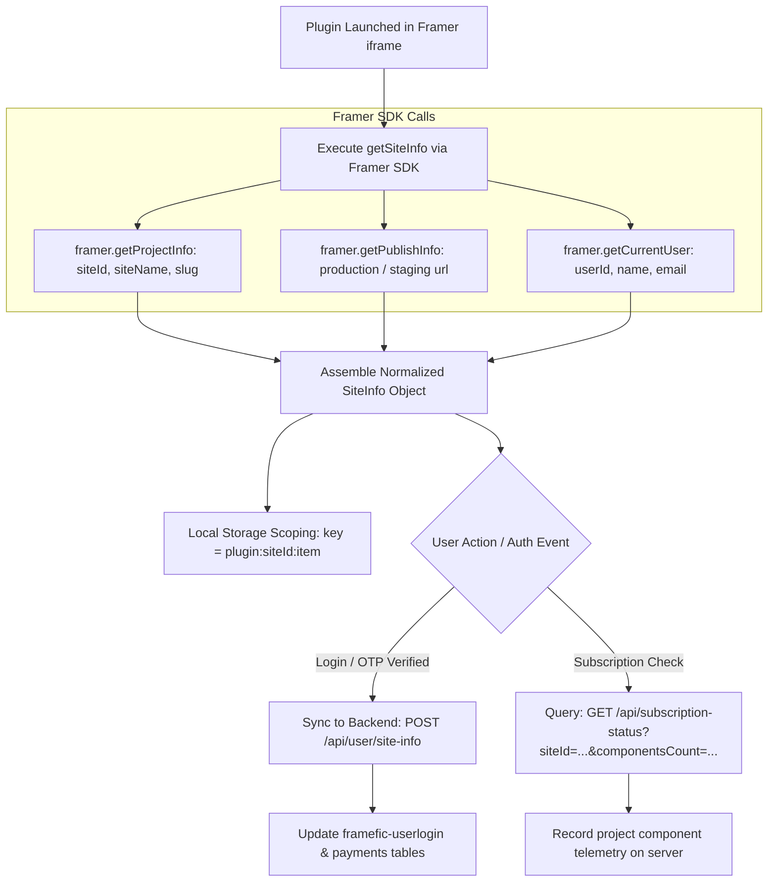

# Company Framer Plugin Telemetry & Tracking Reference Guide

This document defines the complete telemetry and tracking architecture used across the company's Framer plugins. It details how the frontend plugin extracts project metadata, tracks user identity, synchronizes site details with the backend database, reports component usage, and adheres to strict Framer API guardrails.

---

## 1. The Core Telemetry Workflow



---

## 2. Framer Project & User Extraction: `getSiteInfo()`

The frontend plugin must extract metadata strictly through official Framer SDK methods.

### 2.1. Authoritative Implementation (`src/lib/framer/project.ts`)

```typescript
import { framer } from "framer-plugin";

export interface SiteInfo {
  siteId: string | null;
  siteName: string | null;
  siteUrl: string | null;
  userId: string | null;
  userName: string | null;
  userEmail: string | null;
}

/**
 * Retrieves Framer project and user identifiers strictly via official Framer SDK methods.
 * Complies with Framer marketplace review requirements:
 * - siteId (projectInfo.id): Scopes plugin configuration storage and binds Pro licenses to project.
 * - siteName: Displayed in subscription management and Stripe invoice receipts.
 * - siteUrl: Used for authorized domain verification and receipt reference.
 * - currentUser: Used to prefill OTP authentication and identify user accounts.
 */
export const getSiteInfo = async (): Promise<SiteInfo> => {
  try {
    const [projectInfo, publishInfo, currentUser] = await Promise.all([
      framer.getProjectInfo().catch(() => null),
      framer.getPublishInfo().catch(() => null),
      (typeof (framer as any).getCurrentUser === "function"
        ? (framer as any).getCurrentUser().catch(() => null)
        : (typeof (framer as any).getUserInfo === "function"
            ? (framer as any).getUserInfo().catch(() => null)
            : null)),
    ]);

    const siteId = projectInfo?.id ?? null;
    const siteName = (projectInfo as any)?.name ?? (projectInfo as any)?.title ?? "Framer Site";

    // 1. Direct Framer SDK URL / Domain properties
    const rawUrl =
      publishInfo?.production?.url ||
      publishInfo?.staging?.url ||
      (projectInfo as any)?.url ||
      (projectInfo as any)?.publishedUrl ||
      (projectInfo as any)?.domain ||
      (projectInfo as any)?.customDomain ||
      (projectInfo as any)?.subdomain ||
      (projectInfo as any)?.stagingUrl ||
      (projectInfo as any)?.previewUrl ||
      (projectInfo as any)?.webUrl ||
      null;

    let siteUrl: string | null = null;

    if (rawUrl && typeof rawUrl === "string") {
      siteUrl = rawUrl.startsWith("http") ? rawUrl : `https://${rawUrl}`;
    }

    // 2. Referrer & Window Location fallback for draft/preview
    if (!siteUrl && typeof window !== "undefined") {
      if (
        document.referrer &&
        (document.referrer.includes(".framer.app") || document.referrer.includes(".framer.website"))
      ) {
        try {
          const refUrl = new URL(document.referrer);
          if (refUrl.origin) siteUrl = refUrl.origin;
        } catch {
          // ignore
        }
      }
      if (!siteUrl && window.location && window.location.href) {
        try {
          const locUrl = new URL(window.location.href);
          if (
            locUrl.hostname &&
            !locUrl.hostname.includes("localhost") &&
            !locUrl.hostname.includes("127.0.0.1")
          ) {
            siteUrl = locUrl.origin;
          }
        } catch {
          // ignore
        }
      }
    }

    // 3. Fallback based on project slug or ID
    if (!siteUrl && projectInfo) {
      if ((projectInfo as any).slug) {
        siteUrl = `https://${(projectInfo as any).slug}.framer.app`;
      } else if (projectInfo.id) {
        siteUrl = `https://${projectInfo.id}.framer.app`;
      } else if (siteName) {
        const slugified = siteName
          .toLowerCase()
          .trim()
          .replace(/[^a-z0-9]+/g, "-")
          .replace(/^-+|-+$/g, "");
        if (slugified) {
          siteUrl = `https://${slugified}.framer.app`;
        }
      }
    }

    return {
      siteId,
      siteName,
      siteUrl: siteUrl || "https://framer.app",
      userId: currentUser?.id ?? (projectInfo as any)?.userId ?? null,
      userName: currentUser?.name ?? currentUser?.displayName ?? currentUser?.fullName ?? null,
      userEmail: currentUser?.email ?? null,
    };
  } catch (err: any) {
    console.warn("⚠️ getSiteInfo failed:", err?.message || err);
    return {
      siteId: null,
      siteName: null,
      siteUrl: null,
      userId: null,
      userName: null,
      userEmail: null,
    };
  }
};
```

---

## 3. Framer Site Details Sync: `/api/user/site-info`

Whenever a user logs in, signs up, or refreshes their subscription, the frontend syncs Framer project details to the backend database.

### 3.1. Frontend Sync Call (`src/features/auth/services/authService.ts`)

```typescript
import { buildApiUrl } from "./apiHelper";
import { getSiteInfo } from "../../../lib/framer/project";

export const syncSiteInfoToBackend = async (email?: string | null) => {
  try {
    const info = await getSiteInfo();
    const token = localStorage.getItem("framefic_auth_token");
    const resolvedEmail = email || info.userEmail;

    if (!info.siteId && !resolvedEmail) return;

    await fetch(buildApiUrl("/api/user/site-info"), {
      method: "POST",
      headers: {
        "Content-Type": "application/json",
        ...(token ? { Authorization: `Bearer ${token}` } : {}),
      },
      body: JSON.stringify({
        email: resolvedEmail,
        userId: info.userId,
        siteId: info.siteId,
        siteName: info.siteName,
        framerSiteName: info.siteName,
        siteUrl: info.siteUrl,
        framerSiteUrl: info.siteUrl,
      }),
    });
  } catch (err) {
    console.warn("⚠️ Failed to sync site-info:", err);
  }
};
```

### 3.2. Backend Database Update (`server/index.js`)
On the Express backend, this updates both user accounts and payment records:

```javascript
app.post(['/api/user/site-info', '/api/auth/update-site-info'], async (req, res) => {
  try {
    const { email, siteName, framerSiteName, siteUrl, framerSiteUrl, userId, siteId } = req.body;
    const finalSiteName = framerSiteName || siteName || null;
    const finalSiteUrl = framerSiteUrl || siteUrl || null;
    const targetEmail = email ? email.toLowerCase().trim() : null;

    if (!targetEmail && !userId && !siteId) {
      return res.status(400).json({ message: 'Identifier (email, userId, or siteId) is required.' });
    }

    // 1. Update user account table
    if (userId) {
      await db.query(
        'UPDATE `framefic-userlogin` SET framer_site_name = COALESCE(?, framer_site_name), framer_site_url = COALESCE(?, framer_site_url) WHERE id = ?',
        [finalSiteName, finalSiteUrl, userId]
      );
    } else if (targetEmail) {
      await db.query(
        'UPDATE `framefic-userlogin` SET framer_site_name = COALESCE(?, framer_site_name), framer_site_url = COALESCE(?, framer_site_url) WHERE email = ?',
        [finalSiteName, finalSiteUrl, targetEmail]
      );
    }

    // 2. Update payments table
    if (siteId) {
      await db.query(
        'UPDATE payments SET site_name = COALESCE(?, site_name), site_url = COALESCE(?, site_url) WHERE site_id = ?',
        [finalSiteName, finalSiteUrl, siteId]
      );
    } else if (targetEmail) {
      await db.query(
        'UPDATE payments SET site_name = COALESCE(?, site_name), site_url = COALESCE(?, site_url) WHERE email = ?',
        [finalSiteName, finalSiteUrl, targetEmail]
      );
    }

    res.json({
      success: true,
      message: 'Framer site information updated successfully.',
      framer_site_name: finalSiteName,
      framer_site_url: finalSiteUrl,
    });
  } catch (err) {
    console.error('❌ Error updating site info:', err);
    res.status(500).json({ message: err.message });
  }
});
```

---

## 4. Component Telemetry Tracking (`componentsCount`)

To track plugin adoption and monitor plan limits, the frontend counts deployed code components and passes that count to the subscription status endpoint.

### 4.1. Safe Component Counting with `framer.mode` Guardrail

> [!CAUTION]
> **CRITICAL FRAMER API RULE**: Calling `framer.getCodeFiles()` when the plugin runs inside managed CMS collection synchronization (`configureManagedCollection` or `syncManagedCollection`) causes immediate permission errors. You MUST always verify `framer.mode` first.

```typescript
export const getActiveComponentsCount = async (pluginPrefix: string): Promise<number> => {
  try {
    // Check mode first
    const isManaged =
      framer.mode === "configureManagedCollection" ||
      framer.mode === "syncManagedCollection";

    if (isManaged) {
      return 0; // Skip code file scanning during managed collection mode
    }

    const isAllowed =
      typeof framer.isAllowedTo === "function"
        ? framer.isAllowedTo("createCodeFile")
        : true;

    if (!isAllowed) return 0;

    const files = await framer.getCodeFiles();
    const pluginFiles = files.filter((f) => f.name.startsWith(pluginPrefix));
    return pluginFiles.length;
  } catch (err) {
    console.warn("⚠️ Could not count component files:", err);
    return 0;
  }
};
```

### 4.2. Sending Count to Backend

```typescript
export const checkSubscriptionStatus = async (
  siteId: string,
  componentsCount: number | null = null
) => {
  const params = new URLSearchParams({ siteId });
  if (componentsCount !== null) {
    params.append("componentsCount", String(componentsCount));
  }

  const response = await fetch(
    buildApiUrl(`/api/subscription-status?${params.toString()}`)
  );
  return response.json();
};
```

---

## 5. Local Usage Tracking: The First-Use Flag

Local usage flags guide user onboarding and trigger client-side telemetry without server roundtrips:

```typescript
import { getSiteInfo } from "./framer/project";

const getStorageKey = (siteId: string | null, suffix: string) =>
  `framefic-user:${siteId || "default"}:${suffix}`;

/**
 * Check if this is the user's first creation in this Framer project.
 */
export const isFirstAction = async (actionKey: string): Promise<boolean> => {
  try {
    const siteInfo = await getSiteInfo();
    const key = getStorageKey(siteInfo.siteId, actionKey);
    return !window.localStorage.getItem(key);
  } catch {
    return false;
  }
};

/**
 * Mark that the user has completed this action in this project.
 */
export const markActionCompleted = async (actionKey: string): Promise<void> => {
  try {
    const siteInfo = await getSiteInfo();
    const key = getStorageKey(siteInfo.siteId, actionKey);
    window.localStorage.setItem(key, "true");
  } catch {
    // ignore
  }
};
```

---

## 6. Framer Plugin Data Storage & 2kB Limit Optimization

Framer enforces a **hard 2kB limit** on `framer.setPluginData(key, value)`. Attempting to save larger payloads will throw a fatal error.

### 6.1. Differential Compression Strategy
When persisting user presets or widget configurations:
1. Define standard `DEFAULT_CONFIG` constants.
2. Only serialize properties that differ from the defaults.
3. On read, merge the stored diff back onto `DEFAULT_CONFIG`.

```typescript
export function compressConfig<T extends Record<string, any>>(
  current: T,
  defaults: T
): Partial<T> {
  const diff: Partial<T> = {};
  for (const key of Object.keys(current) as (keyof T)[]) {
    if (JSON.stringify(current[key]) !== JSON.stringify(defaults[key])) {
      diff[key] = current[key];
    }
  }
  return diff;
}

export function decompressConfig<T extends Record<string, any>>(
  storedDiff: Partial<T>,
  defaults: T
): T {
  return { ...defaults, ...storedDiff };
}
```
