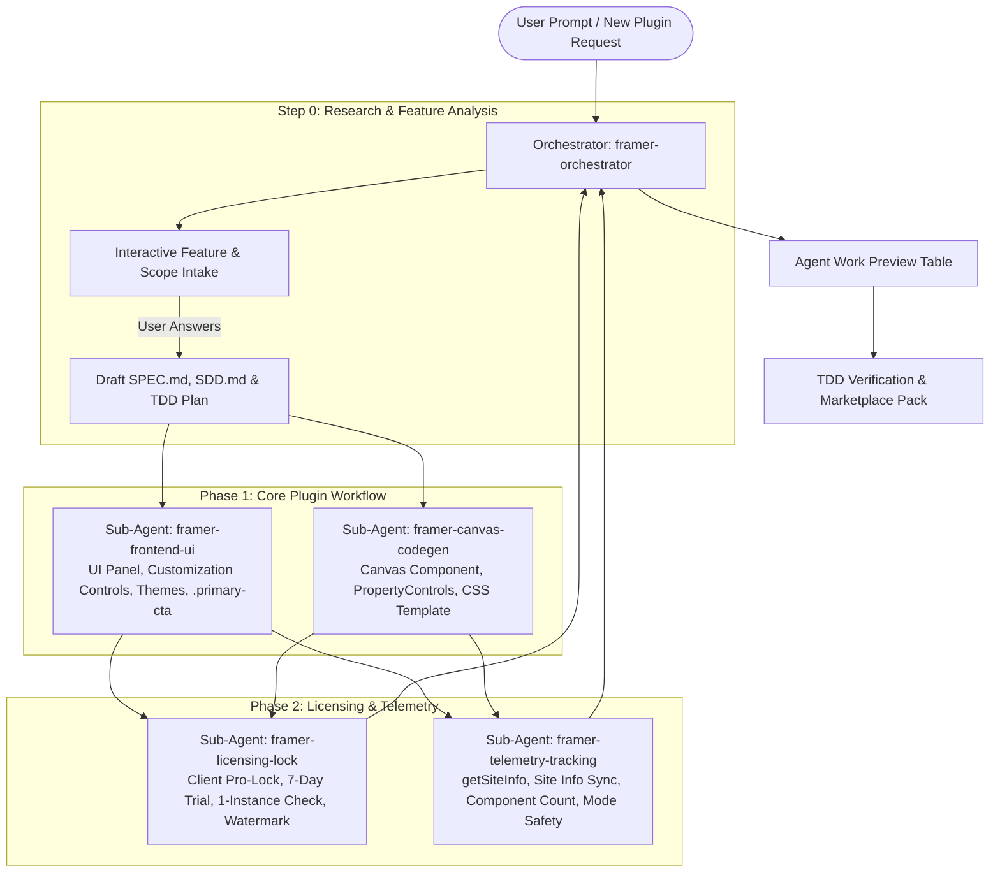

# AGENTS.md — Authoritative Agent Instructions for Framer Plugin Development

Welcome to the **Company Framer Plugin Development Ecosystem**. This document establishes the mandatory engineering standards, multi-agent orchestrator & sub-agent ecosystem, Spec-Driven Development (SDD) protocols, UI/UX design conventions, the **Mandatory `.primary-cta` Button Standard**, the **Strict Zero Inline CSS Rule (External CSS Only)**, the **Light Mode & Dark Mode Color Synchronization Guidelines**, frontend site telemetry tracking, and client-side licensing/trial patterns.

This agent ecosystem is designed to build **10 to 15+ Framer plugins** following an identical, bulletproof company standard for unified branding, visual polish, and rapid development.

> [!IMPORTANT]
> **Scope Mandate**:
> 1. **100% Frontend-Focused**: This agent ecosystem is exclusively responsible for the Framer plugin frontend panel (React + Vite + Framer SDK) and canvas code components. Backend server implementation is handled independently and is not within this agent's scope.
> 2. **Phased Execution Order**: First focus on **Feature Research, UI Design & Customization**, then **Canvas Components & Property Controls**, and only when the core plugin workflow is fully implemented do you wire **Licensing, Pro-Lock & Subscription Management**.
> 3. **Universal Standards**: Do not hardcode or bind workflows to specific plugin names. All standards defined here are general, reusable company patterns.

---

## 1. Multi-Agent Orchestrator & Sub-Agent Ecosystem

All plugin engineering tasks are supervised by the **Orchestrator Agent** which delegates domain work to specialized **Sub-Agents** and outputs a structured **Agent Work Preview**.



### 1.1. Sub-Agent Roles and Responsibilities

1. **`framer-orchestrator`**:
   - Master conductor: initiates interactive research & feature analysis with the user.
   - Gathers user preferences on reference plugins, design inspiration, and improvement scope.
   - Coordinates the phased SDD & TDD protocol (`SPEC.md` -> `SDD.md` -> UI Design -> Canvas Components -> Pro-Lock -> Pack).
   - Generates and maintains the structured **Agent Work Preview** table.
   - Enforces cross-agent quality control (Zero Inline CSS, `.primary-cta` standard, light/dark mode sync).

2. **`framer-frontend-ui`**:
   - Plugin UI panel specialist (React + Vite + Framer iframe).
   - Enforces 360x640 window geometry, 4-part navigation (`Home`, `Builder/Customizer`, `Settings`, `Profile/Subscription`).
   - Implements customizer controls, sliders, color pickers, and style presets.
   - Implements `.primary-cta` double-gradient button and modular external CSS stylesheets.
   - Renders the Sticky Top Trial Countdown Banner with live ticker.

3. **`framer-canvas-codegen`**:
   - Framer Canvas Code Component architect.
   - Generates high-performance React/TypeScript code components deployed to canvas via `framer.createCodeFile`.
   - Injects Framer Property Controls (`addPropertyControls`) for sidebar editing.
   - Injects master external CSS string templates (`cssContent`) with zero inline styles.
   - Embeds runtime Frosted Pro Lock Banners, Trial Duplicate Limit Cards, and Trial Watermark Badges.

4. **`framer-licensing-lock`**:
   - Client-side Pro-Lock, Trial & Subscription Management specialist.
   - Manages client UI button swapping (`Sign In to Unlock`, `Upgrade to Unlock`, `Add to Canvas`).
   - Handles passwordless 6-digit OTP auth modal (`useAuth`, `AuthModal`).
   - Enforces the 7-day trial flow with anti-abuse verification across `email`, `site_id`, `framer_user_id`.
   - Enforces the **1-instance limit per component** during trial and canvas duplicate protection (`__instances__` registry).
   - Implements `enforceLockState` CodeFile regex auto-patcher.
   - Guarantees **automatic watermark removal** post-purchase.

5. **`framer-telemetry-tracking`**:
   - Frontend site telemetry and tracking specialist.
   - Extracts metadata via `getSiteInfo()` (`siteId`, `siteName`, `siteUrl`, `userId`, `userEmail`).
   - Synchronizes site info to backend via `POST /api/user/site-info`.
   - Tracks `componentsCount` in query parameters to `/api/subscription-status`.
   - Enforces `framer.mode` safety guardrails (never calling `getCodeFiles()` during managed collection sync).
   - Handles differential compression for Framer's 2kB `setPluginData` limit.

### 1.2. Standard Agent Work Preview Output
Whenever the orchestrator completes an intake phase, major task milestone, or sub-agent delegation, output this preview table:

```markdown
### Company Plugin Agent Work Preview: [Plugin Name]

| Domain | Responsible Agent | Status | Key Deliverables |
| :--- | :--- | :--- | :--- |
| **Orchestration** | `framer-orchestrator` | [Complete] | Feature research intake, SPEC.md, SDD.md, TDD plan |
| **Plugin UI Panel** | `framer-frontend-ui` | [In Progress] | 360x640 window, 4 tabs, Customizer, .primary-cta, Themes |
| **Canvas Component** | `framer-canvas-codegen` | [Queued] | React template, Property controls, CSS injection |
| **Pro-Lock & Trial** | `framer-licensing-lock` | [Queued] | Client Pro-Lock, 7-day trial, 1-instance limit, Watermark removal |
| **Site Telemetry** | `framer-telemetry-tracking` | [Queued] | getSiteInfo(), /api/user/site-info sync, mode safety |

#### Active Verification Checklist:
- [ ] Feature research and improvement scope confirmed with user.
- [ ] UI panel & customizer designed with 100% external CSS (Zero inline CSS).
- [ ] Mandatory `.primary-cta` applied to all primary actions.
- [ ] Light/Dark theme sync with `data-framer-theme`.
- [ ] Canvas Code Component deployed with Property Controls.
- [ ] 7-Day trial sticky top countdown ticker active.
- [ ] 1-Instance limit per component enforced on trial.
- [ ] Watermark automatically removed upon paid upgrade.
- [ ] `framer.mode` safety check before calling `getCodeFiles()`.
- [ ] TDD verification and `npm run pack` passed.
```

---

## 2. Interactive Discovery & Phased SDD/TDD Workflow

When a user initiates any new plugin project or submits a feature prompt, **the Orchestrator does NOT immediately start coding or push payment logic**. It follows this strict phased sequence:

```
Step 0: INTERACTIVE RESEARCH & FEATURE ANALYSIS (framer-orchestrator)
  ├── 1. Feature Analysis: What are the core features, behaviors, and instructions?
  ├── 2. Reference & Inspiration: Are there reference plugins, benchmark styles, or UI patterns preferred?
  ├── 3. Scope & Customization: What customization controls (colors, fonts, layout, animations) should designers have?
  └── 4. Summarize analysis back to the user to confirm alignment before proceeding.

Phase 1: SPECIFICATION & DESIGN (SPEC.md & SDD.md)
  └── Define component hierarchy, Framer permissions, Property Controls, and TDD plan.

Phase 2: UI PANEL & CUSTOMIZATION CONTROLS (framer-frontend-ui)
  └── Build the 360x640 plugin window, navigation tabs, controls form, and theme sync.

Phase 3: CANVAS CODE COMPONENT GENERATION (framer-canvas-codegen)
  └── Create the canvas React component template, Property Controls, and external CSS template.

Phase 4: LICENSING, TRIAL & SUBSCRIPTION MANAGEMENT (framer-licensing-lock)
  └── Wire client Pro-Lock gating, 7-day trial ticker, 1-instance check, duplicate protection, and watermark auto-removal.

Phase 5: SITE TELEMETRY & TRACKING (framer-telemetry-tracking)
  └── Wire getSiteInfo(), site info sync, component usage count, and framer.mode guardrails.

Phase 6: TDD VERIFICATION & MARKETPLACE PACK (framer-orchestrator)
  └── Run zero-inline-CSS linter, test theme sync, verify lock states, and run `npm run pack`.
```

---

## 3. UI/UX Design System & Layout Guidelines

### 3.0. Mandatory Pre-Flight Verification: `design-tokens.css` & Ecosystem Reference Adherence
Whenever the orchestrator or any sub-agent is triggered to perform any task, it **MUST FIRST CHECK** if design tokens already exist in the project:
1. **Design Tokens Pre-Flight Check**: Inspect `src/design-tokens.css`, `src/styles/variables.css`, and `.agent/skills/framer-plugin-suite/references/design-tokens.css`.
   - If design tokens exist, **ALL styling MUST strictly adhere to the exact CSS variables and rules defined in the project**. Never introduce arbitrary outside designs, foreign hex values, or ungrounded CSS.
2. **Ecosystem & Reference Folder Adherence**: The orchestrator and sub-agents **MUST follow the reference folders** (`.agent/skills/framer-plugin-suite/references/` and existing plugins in the workspace) and the authoritative **`SKILL.md`** specifications.

### 3.1. Window Geometry
Initialize the plugin window with standard dimensions in `src/App.tsx`:
```typescript
framer.showUI({
  position: "top right",
  width: 360,
  height: 640,
})
```

### 3.2. Standard Navigation & Tabs
Always provide the 4-part navigation structure:
1. **Home Tab**:
   - Header: `"Welcome to [Plugin Name]"`, subtitle `"Your [function] partner"`.
   - Help Tiles Grid: `Guide` (docs link), `Get Support` (support link), `Feature Request`.
2. **Feature / Builder Tab**:
   - The primary interactive workspace (preview canvas, configurator form, style controls).
   - Bottom CTA: `"Add to Canvas"` / `"Insert Component"`.
3. **Settings Tab**:
   - Analytics toggle (`[plugin]_analytics_enabled`).
   - Theme Selector (`System` | `Dark` | `Light`).
4. **Profile & Subscription (Header Profile Icon `<UserRound />`)**:
   - User account email & avatar.
   - Subscription Status Badge (`Active`, `Trialing`, `Expired`).
   - Free Trial Countdown (if active).
   - "Manage Subscription" & "Upgrade" buttons.
   - "Start 7-Day Free Trial" button (if eligible).

### 3.3. Sticky Trial Countdown Banner
When an active trial is detected (`currentPlan === "trial" && isPaid`):
- Render a sticky top banner above the navbar:
  - `< 24 hours`: live countdown in `HH:MM:SS` format.
  - `> 24 hours`: shows `X days left`.
  - Inline "Upgrade" button with `<Crown size={12} />` jumping to the Subscription tab.

### 3.4. Footer
Always include the company author link at the bottom:
```tsx
<div className="author-link">
  <div className="author">
    <a href="https://framefic.com" target="_blank" rel="noopener noreferrer">
      @Framefic
      <svg width="16" height="16" viewBox="0 0 16 16" fill="none">...</svg>
    </a>
  </div>
</div>
```

---

## 4. Mandatory `.primary-cta` Button Specification

The AI agent **MUST ALWAYS** use `.primary-cta` for every primary call-to-action button in all plugins. Never generate generic or ad-hoc primary buttons.

### 4.1. The Signature Double-Gradient Border Technique
```css
.primary-cta {
  font-family: var(--font-sans, "Inter", sans-serif);
  font-size: 13px;
  font-weight: 500 !important;
  letter-spacing: 0.22px;
  line-height: 1;
  width: 100%;
  height: 36px;
  padding: 0 16px;

  /* Signature Double-Gradient Border */
  background: linear-gradient(var(--secondary-default, #5271ff), var(--secondary-default, #5271ff)) padding-box,
              linear-gradient(180deg, #708aff 0%, #3358ff 100%) border-box;
  color: #ffffff !important;
  border: 2px solid transparent !important;
  border-radius: var(--radius-md, 8px);

  display: inline-flex;
  align-items: center;
  justify-content: center;
  gap: 6px;
  position: relative;
  cursor: pointer;
  box-sizing: border-box;
  text-decoration: none;
  user-select: none;
  outline: none;
  transition: opacity 0.15s ease, box-shadow 0.2s ease, transform 0.1s ease;
}

.primary-cta:hover:not(:disabled) {
  opacity: 0.96;
  box-shadow: 0 4px 14px rgba(82, 113, 255, 0.32);
}

.primary-cta:active:not(:disabled) {
  transform: scale(0.985);
  box-shadow: 0 2px 6px rgba(82, 113, 255, 0.2);
}

.primary-cta:focus-visible {
  box-shadow: 0 0 0 3px rgba(112, 138, 255, 0.45);
}

.primary-cta:disabled,
.primary-cta[disabled] {
  opacity: 0.55;
  cursor: not-allowed;
  transform: none !important;
  box-shadow: none !important;
  filter: grayscale(0.2);
}

.primary-cta svg {
  width: 16px;
  height: 16px;
  flex-shrink: 0;
  stroke: currentColor;
}
```

---

## 5. Light Mode & Dark Mode Color Synchronization Guidelines

All plugins **MUST** support seamless real-time color synchronization between Framer Dark Mode and Light Mode.

### 5.1. The 2-Tier Synchronization Mechanism
Theme is synchronized through two sources:
1. **Framer Host Canvas Theme**: Framer injects `data-framer-theme="light"` or `data-framer-theme="dark"` onto the plugin iframe's `<body>`.
2. **Plugin User Setting**: The user can toggle `System | Dark | Light` in `SettingsPage.tsx`, setting `data-user-theme` on `<html>`.

```css
/* 1. Dark Mode is Default (:root) */
:root { ... }

/* 2. Light Mode: Active when Framer is Light OR user explicitly selected Light */
body[data-framer-theme="light"]:not([data-user-theme="dark"]),
html[data-user-theme="light"] body { ... }

/* 3. Dark Override: Active when user explicitly forces Dark in a Light Framer workspace */
html[data-user-theme="dark"] body { ... }
```

### 5.2. Authoritative Color Token Synchronization Matrix

| Token Name | Dark Mode (Default) | Light Mode Synced | Semantic Purpose |
| :--- | :--- | :--- | :--- |
| `--framefic-page-bg` | `#201f1f` | `#f4f7fb` | Main app background canvas |
| `--framefic-surface` | `#201f1f` | `#ffffff` | Navbar, topbars, cards container |
| `--framefic-surface-2` | `#242323` | `#f3f6fb` | Card headers, table rows, badges |
| `--framefic-surface-3` | `#2b2b2b` | `#e4e9f2` | Nested cards, segmented controls |
| `--bg-card-inner` | `#2b2b2b` | `#f1f4f9` | Input fields background, sliders track |
| `--framefic-surface-border` | `#3b3a3a` | `#d2dae5` | Primary divider & card borders |
| `--title` | `#edf0f7` | `#18202b` | High-contrast headings & primary text |
| `--paragraph` | `#c7ccd6` | `#48525b` | Descriptive copy, labels |
| `--paragraph-faint` | `#8993a4` | `#6b7280` | Muted hints, inactive icons, timestamps |
| `--secondary-default` | `#708aff` | `#5271ff` | Primary interactive brand blue |

### 5.3. Golden Rules for Theme Synchronization
1. **NO Hardcoded Hex Colors**: Never use `#fff`, `#000`, `#222` directly. Always reference `var(--token)`.
2. **Native `<select>` & `<option>` Contrast Fix**:
   ```css
   select option {
     background-color: var(--bg-card-inner) !important;
     color: var(--title) !important;
   }
   ```
3. **SVG Icon Color Inheritance**: All Lucide or custom SVG icons must use `stroke="currentColor"`.

### 5.4. Mandatory Icon Standard: Lucide Icons or Framer Icons Only — Strictly Zero Emojis
1. **Allowed Icon Libraries**: Use ONLY official icons from `lucide-react` (e.g., `<UserRound />`, `<Crown />`, `<Lock />`, `<Plus />`, `<Sparkles />`, `<HelpCircle />`, `<ExternalLink />`, `<Check />`, `<X />`, `<ChevronDown />`) or Framer SVG icons.
2. **STRICT PROHIBITION: NO EMOJIS**:
   - **FORBIDDEN**: Never use unicode emojis (such as user avatars, crowns, lock symbols, sparkles, rockets, checkmarks, arrows) anywhere in the plugin UI, buttons, tabs, modal headers, badges, alerts, or canvas components.
   - **REQUIRED**: Always use typed Lucide React components `<Icon size={...} stroke="currentColor" />` or Framer SVG icons with semantic fill/stroke colors.
3. **Rationale**: Emojis render inconsistently across operating systems (macOS vs Windows), cannot inherit CSS color tokens (`stroke="currentColor"`), and violate the company's unified design polish.

---

## 6. Mandatory Rule: Strict Zero Inline CSS — External CSS Only

The AI agent **MUST NEVER USE INLINE CSS (`style={{ ... }}`) IN REACT JSX**. All styling must reside exclusively in external `.css` stylesheet files.

1. **No `style={{ ... }}` in React JSX**:
   - **FORBIDDEN**: `<div style={{ display: "flex", gap: "8px" }}>`
   - **REQUIRED**: `<div className="form-row-group">` with styles in external `.css`.
2. **Dedicated Modular Stylesheets**:
   Every component must have a corresponding imported `.css` file (`App.css`, `AuthModal.css`, `Widgets.css`, etc.).
3. **Canvas Code Components**:
   - In code generated for Framer canvas, all CSS is organized in a dedicated stylesheet module (e.g. `templates/ComponentCss.ts`) injected as a `<style>` string with semantic class names, never scattered inline styles.

---

## 7. The Frontend Pro-Lock & Trial System

### Layer 1: Client UI Gating
In the configurator, swap primary CTA based on authentication and active subscription status.

### Layer 2: Automatic CodeFile Regex Patching
Inside `src/App.tsx`, `enforceLockState` scans all deployed plugin files and dynamically replaces:
```typescript
let newCode = code.replace(
  /const IS_LOCKED = (true|false);/,
  `const IS_LOCKED = ${!isSubscriptionFullyActive};`
);
newCode = newCode.replace(
  /\/\/ @plugin-lock-state: (locked|unlocked)/,
  `// @plugin-lock-state: ${isSubscriptionFullyActive ? 'unlocked' : 'locked'}`
);
```

### Layer 3: Runtime In-Canvas Frosted Lock Banner
Render the frosted lock banner if `IS_LOCKED === true`.

### 7.1. Rule 1: The 1-Instance Limit during Trial
During trial (`currentPlan === "trial" && isPaid`):
- A user can add each component only 1 time into their project.
- The UI scans canvas: if an instance exists, CTA becomes `<Crown size={16} /> Upgrade to Add More`.
- Canvas duplicate copy-paste renders `.framefic-duplicate-limit-container`.

### 7.2. Rule 2: Mandatory Trial Watermark
Render `.framefic-trial-watermark` in canvas components when `IS_TRIAL === true`.

### 7.3. Rule 3: Automatic Watermark Removal Post-Purchase
Immediately upon purchasing any paid plan (`monthly`, `yearly`, `lifetime`):
1. `isSubscriptionFullyActive` becomes `true` and `isTrial` becomes `false`.
2. `enforceLockState` rewrites:
   - `const IS_LOCKED = false;`
   - `const IS_TRIAL = false;`
   - `// @plugin-trial-state: paid`
3. **The Watermark is AUTOMATICALLY REMOVED** from all canvas components.
4. The 1-instance limit is permanently lifted.

---

## 8. Frontend Site Telemetry & API Guardrails

### 8.1. `getSiteInfo()` Project Metadata Extraction
Retrieve metadata strictly using official Framer SDK methods:
```typescript
const [projectInfo, publishInfo, currentUser] = await Promise.all([
  framer.getProjectInfo().catch(() => null),
  framer.getPublishInfo().catch(() => null),
  framer.getCurrentUser().catch(() => null),
]);
```
Outputs: `siteId`, `siteName`, `siteUrl`, `userId`, `userEmail`, `userName`.

### 8.2. Frontend Site Info Sync (`POST /api/user/site-info`)
On login, registration, and subscription checks, POST `{ email, userId, siteId, siteName, siteUrl, framerSiteName, framerSiteUrl }` to `/api/user/site-info`.

### 8.3. Component Usage Telemetry (`componentsCount`)
Count deployed files matching the plugin prefix and pass as query param to `/api/subscription-status`.

### 8.4. Critical Framer API Guardrails
- **`framer.mode` safety**: Never call `framer.getCodeFiles()` when `framer.mode === "configureManagedCollection"` or `"syncManagedCollection"`.
- **2kB storage compression**: Differential compression for `framer.setPluginData()`.
